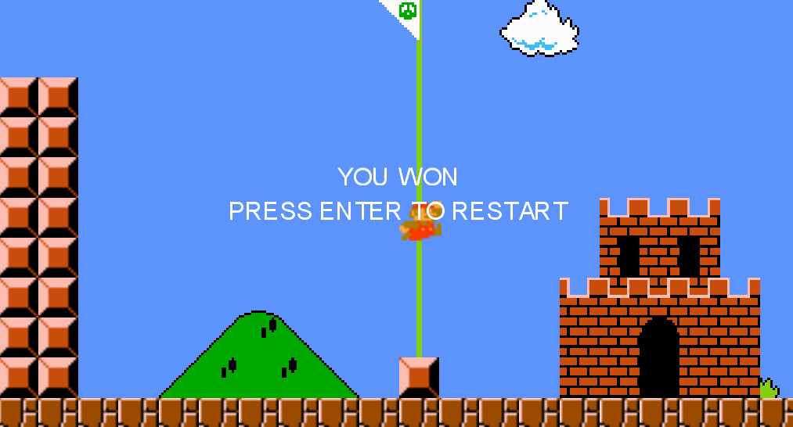

## FASI DEL GIOCO

### INIZIO
Appena iniziati, Mario apparirà subito all’inizio del livello.

Per muoversi nel livello, premere le frecce direzionali **Sinistra/Destra**

---

### SALTO
Per comodità, al posto della barra spaziatrice, abbiamo deciso di utilizzare il tasto **Z** per effettuare il salto. Così facendo, Mario eseguirà un piccolo salto, ma se si tiene premuto eseguirà un salto ancora più in alto.

---

### SCATTO (Sprint)
Per far correre più veloce l’idraulico, basta premere il tasto **Shift Sinistro/Destro** e Mario subito inizierà a scattare verso la direzione desiderata!

**Nota bene:** date le fisiche, Mario potrebbe risultare un po’ scivoloso, quindi attenzione quando correte troppo veloci!

---

### PAUSA
Se la mamma vi chiama a tavola perché è pronto non preoccuparti! Avrai la possibilità di mettere in pausa il gioco e riprendere più tardi come se non ti fossi mai fermato! Ti basta solo premere il tasto **P** per fermare il tempo e mangiare con calma, senza avere la fretta di tornare a giocare.

---

## COLLISIONI
Ricorda bene che, come nell’originale, Mario può saltare sopra tubi e blocchi, ma questo può anche bloccarlo, perciò ricorda di sfruttare il salto (e sfruttalo bene, dato che i Goomba non sono l’unico ostacolo di Mario!)

---

## BUCHE
Fai attenzione! Se cadi in una delle buche, Mario morirà!

---

## GOOMBA
Anche se dall’aspetto “innocuo”, questi funghi marroni non sono per niente amichevoli. Toccarli potrebbe avere gravi conseguenze, ma l’idraulico ha la possibilità di schiacciarli come insetti!

---

## FINE DEL LIVELLO
Quando Mario raggiunge la sua destinazione, il gioco si concluderà! Naturalmente, non essendo una ricreazione al 100% completa, verrete avvisati con una scritta su schermo:

  <strong>YOU WON PRESS ENTER TO RESTART</strong>

E dopo di che, potrete riprovare e, magari, battere il livello il più velocemente possibile ;)
